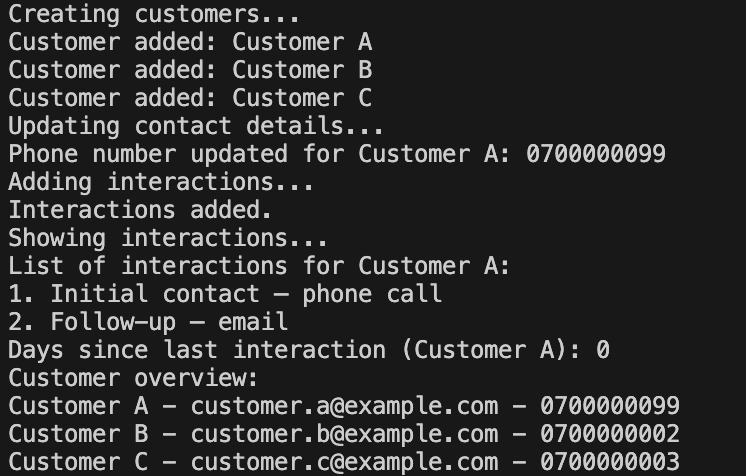

# Customer Data System

Built as part of a course in object-oriented programming.

A Python project for managing customer data and interactions, inspired by basic CRM functionality.

## Example Output



## Overview

This project explores how customer data can be structured and handled in code.

The system supports:
- adding customers with email and phone number
- updating customer information
- logging interactions
- tracking time since last interaction
- basic validation and error handling

## Why this project

The goal was to better understand how CRM-like systems work in practice.

It focuses on:
- structuring customer data
- keeping track of interactions over time
- handling updates and edge cases
- working with in-memory data

## Skills demonstrated

- Python
- Object-oriented programming
- Data structures
- Basic system design
- Error handling

## How it works

- Customers are stored in a collection in memory
- Each customer has contact details and a list of interactions
- Each interaction updates the customer’s latest activity timestamp
- The system can calculate time since last interaction
- Errors are raised if a customer does not exist

## Project structure

- `main.py` — core logic and example usage

## Example usage

```python
system = CustomerDataSystem("CRM Demo")

system.add_customer("Customer A", "a@example.com", "0700000000")
system.add_customer_interaction("Customer A", "Initial contact")

customer = system.get_customer("Customer A")
days = customer.days_since_last_interaction()
```

## Notes

- Educational project focused on core logic and structure  
- Uses placeholder data  
- Runs in-memory (no database)  